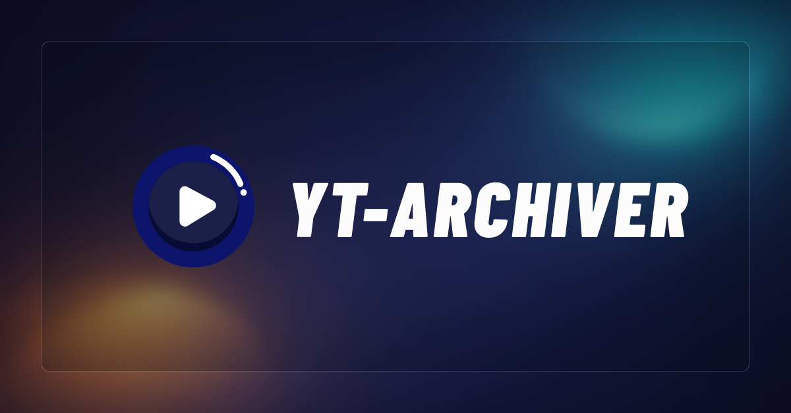

# YT-Archiver

[PT-BR](./README.md) | **EN**

<div align="center">
  
  <br/>
  <br/>
  <a href="https://www.canva.com/design/DAG-I5UrfUM/FMg8nXujmfAdu35FAepRAw/view?utm_content=DAG-I5UrfUM&utm_campaign=designshare&utm_medium=link2&utm_source=uniquelinks&utlId=h019bf85e3a" target=”_blank”><strong>Presentation Link »</strong></a>
  <br/>
  <br/>
</div>

<br/>

Complete system for ethical downloading and archiving of HLS (DRM-free) videos and streams, with modern web interface, optional integration with Google Drive and screen recording functionality.

<a id="index"></a>

## 📑 Index

- [📋 Overview](#overview)
- [🚀 Quick Start](#quick-start)
- [Documentation](#documentation)
- [🌐 Web Interface](#web-interface)
- [📖 Usage](#usage)
- [🔌REST API](#api-rest)
- [📁 Project Structure](#project-structure)
- [🔧 Technologies](#technologies)
- [📝 Archiving System](#archiving-system)
- [📂 Folder Structure](#folder-structure)
- [🍪 Using Cookies](#using-cookies)
- [⚠️ Limitations and Best Practices](#limitations-and-best-practices)
- [🐛 Troubleshooting](#troubleshooting)
- [📄 License](#license)
- [📚 Additional Resources](#additional-resources)

---

<a id="overview"></a>

## 📋 Overview

YT-Archiver combines a robust REST API with a modern web interface to make video downloading and management easy:

- **REST API** (`backend/`): FastAPI with modular architecture, asynchronous job system and integration with Google Drive
- **Web Interface** (`frontend/`): Next.js 15 + shadcn/ui for an intuitive visual experience
- **SSR + Native Cache**: Server Components with revalidate and invalidation by tags via Route Handlers
- **Download Engine**: yt-dlp for YouTube downloads, playlists and HLS streams

### Main Features

- ✅ Download videos from YouTube (channels, playlists, individual videos) and video platforms in general (in some cases the use of cookies will be necessary)
- ✅ Support DRM-free HLS (M3U8) streams
- ✅ Customized headers (Referer, Origin, User-Agent)
- ✅ Customized cookies via Netscape file
- ✅ **Local Video Library** - View, play and manage downloaded videos
- ✅ **Screen recording in browser** - Save recordings directly to library
- ✅ **Sync with Google Drive** - Upload, view and stream videos on Drive
- ✅ **External Upload to Drive** - Upload any video with thumbnail, subtitles and transcript
- ✅ **Drive Sharing** - Generate public link to view videos
- ✅ **Persistent catalog (SQLite)** - Local index + Drive snapshot for quick listing
- ✅ **Asynchronous job system** - Background downloads with real-time progress
- ✅ Filing system to avoid duplicate downloads
- ✅ Quality control and output format
- ✅ Configurable rate limiting (anti-ban for large playlists)
- ✅ Audio extraction (MP3)
- ✅ Download subtitles, thumbnails and metadata
- ✅ Custom filenames and paths
- ✅ **Global Player with PiP** - Play videos in the background while browsing
- ✅ **SSR and smart cache** - Initial rendering with data and invalidation by tags
- ✅ **Local observability** - Prometheus + Grafana with ready-made dashboards
- ✅ Full REST API for integration

---

<a id="quick-start"></a>

## 🚀 Quick Start

### Prerequisites

- Python 3.12+
- Node.js 18+ and npm
- ffmpeg installed on the system

### Installation and Execution

#### Option 1: Automatic Script (Recommended)

```bash
# Linux/Mac
./start-dev.sh

# Windows
start-dev.bat
```

This will:

1. Check if `ffmpeg` is installed (does not install automatically)
2. Configure and activate the backend virtual environment
3. Install Python dependencies
4. Install frontend dependencies (if `node_modules` does not exist)
5. Start the backend on port 8000
6. Start the frontend on port 3000

To start API + worker on dev:

```bash
START_WORKER=true WORKER_PORT=8001 ./start-dev.sh
```

**Access:** http://localhost:3000

#### Option 2: Manual

First, **install ffmpeg on your machine**.

**Backend:**

```bash
cd backend
./run.sh  # Ou: source .venv/bin/activate && uvicorn app.main:app --reload
```

**API + worker (prod or dev):**

```bash
# API sem tasks de background
WORKER_ROLE=api ./run.sh

# Worker com tasks de background
WORKER_ROLE=worker PORT=8001 ./run.sh
```

**Frontend:**

```bash
cd frontend
npm install
npm run dev
```

**Access:**

- Web interface: http://localhost:3000
- API: http://localhost:8000
- API documentation: http://localhost:8000/docs

---

<a id="documentation"></a>

## Documentation

### Entry Point (official)

- General index: **[INDEX.md](./docs/project/en/INDEX.md)**
- Index in English: **[en/INDEX.md](./docs/project/en/INDEX.md)**

### Recommended Reading

1. **[QUICK-START.md](./docs/project/en/QUICK-START.md)** (upload environment and test quickly)
2. **[ARCHITECTURE.md](./docs/project/en/ARCHITECTURE.md)** (high-level view)
3. **[TECHNICAL-REFERENCE.md](./docs/project/en/TECHNICAL-REFERENCE.md)** (technical details)
4. **[OBSERVABILITY.md](./docs/project/en/OBSERVABILITY.md)** (Prometheus + Grafana)
5. **[GOOGLE-DRIVE-SETUP.md](./docs/project/en/GOOGLE-DRIVE-SETUP.md)** and **[GOOGLE-DRIVE-FEATURES.md](./docs/project/en/GOOGLE-DRIVE-FEATURES.md)**
6. **[GLOBAL-PLAYER.md](./docs/project/en/GLOBAL-PLAYER.md)** (background playback)

### Documentation Taxonomy

- `docs/project/`: official/public documentation (current source of truth)
- `docs/local/`: internal work in progress (WIP) notes
- `docs/project/archive/`: old/replaced public documentation
- `docs/local/archive/`: internal history (plans, QA, logs and old decisions)

---

<a id="web-interface"></a>

## 🌐 Web Interface

### UI Features

**Main Page (`/`):**

- 📥 Download form with all configurable options
- 📊 Real-time progress bar during downloads
- 📚 Local video library with thumbnails and duration
- ▶️ Built-in video player (Vidstack)
- 🗑️ Individual or batch deletion of videos
- ℹ️ Detailed video information modal
- ⚙️ Advanced options: headers, cookies, rate limiting, custom naming
- ⚡ SSR + cache for recent videos

**Google Drive page (`/drive`):**

- ☁️ OAuth2 authentication with Google Drive
- 📂 Viewing videos synced to Drive with thumbnails
- ⬆️ Individual or batch upload of local videos
- 🧩 External upload (video + thumbnail + subtitles + transcription)
- ⬇️ Download videos from Drive to local storage
- 🔄 Sync panel showing differences between local and Drive
- ▶️ Direct streaming from Google Drive with seek/skip support
- 🗑️ Individual or batch deletion of videos from Drive
- 🔗 Public sharing with link (on/off per video)
- ℹ️ Detailed video information modal
- ⚡ SSR + cache with tag invalidation

**Record Page (`/record`):**

- 🎥 Screen recording with system audio and microphone
- 💾 Local download or save directly to library
- 🧭 List of recent recordings with automatic refresh

**Global Player (Background Play):**

- 🎵 Minimize videos to play in background
- 🖼️ Browser-native Picture-in-Picture
- 🔊 Volume control on mini bar
- 🔄 Keeps playing when navigating between pages
- 📖 Complete documentation: **[GLOBAL-PLAYER.md](./docs/project/en/GLOBAL-PLAYER.md)**

**Interface Features:**

- ✨ Modern and responsive design (Next.js 15 + Tailwind CSS)
- 🎨 shadcn/ui components (Radix UI primitives)
- 📱 Compatible with desktop and mobile
- 🌙 Dark theme support (via system)
- 🔔 Visual success/error feedback
- ⚡ Real-time progress updates via polling

---

<a id="usage"></a>

## 📖 Usage

### Basic Download

1. Access http://localhost:3000
2. Select the type (Single Video or Playlist)
3. Paste the YouTube URL
4. (Optional) Configure advanced options
5. Click "Download"
6. Track progress in real time
7. Video will automatically appear in the library

### Advanced Options

**Quality Settings:**

- Maximum resolution (height in pixels)
- Audio only (MP3 extraction)
- Download subtitles and thumbnails

**Custom Nomenclature:**

- Custom subfolder (ex: `Músicas/Vídeo 01`)
- Custom file name (ex: `Video 001`)

**HTTP Headers:**

- Custom referer
- Custom origin
- Cookie file (Netscape format)

**Anti-Ban Protection (for large playlists):**

- Delay between videos (recommended: 2-5s)
- Grouping into batches (e.g. 5 videos per batch)
- Delay between batches (recommended: 10-30s)
- Randomization of delays (simulates human behavior)
- **Presets:** Safe, Moderate, Fast

### Integration with Google Drive

**Initial Configuration:**

1. Follow the complete guide: **[GOOGLE-DRIVE-SETUP.md](./docs/project/en/GOOGLE-DRIVE-SETUP.md)**
2. Quick summary:
- Create project in Google Cloud Console
- Activate Google Drive API
- Create OAuth 2.0 credentials (Desktop app)
- Download `credentials.json`
- Insert credentials file in the backend → `backend/credentials.json`

**Using Drive:**

1. Access http://localhost:3000/drive
2. Click "Connect with Google Drive"
3. Authorize the application in the browser
4. Manage Videos:
- 📤 Individual upload or full sync
- 🧩 External upload with custom thumbnail
- 📊 View sync status
- ▶️ Play videos directly from Drive
- 🗑️ Delete videos from Drive

**Drive Catalog (first run / new machine):**

- Drive now uses a **persistent catalog** (local SQLite + snapshot on Drive).
- For the first use on a new machine, import the snapshot:
- `POST /api/catalog/drive/import`
- For the first time that Drive already has videos but there is no snapshot:
- `POST /api/catalog/drive/rebuild`
- To index existing local videos:
- `POST /api/catalog/bootstrap-local`

---

<a id="api-rest"></a>

## 🔌 REST API

The FastAPI API offers complete endpoints for integration:

### Download endpoints

**POST** `/api/download` - Starts a background download

```json
{
  "url": "https://www.youtube.com/watch?v=...",
  "max_res": 1080,
  "subs": true,
  "audio_only": false,
  "path": "Curso/Modulo 01",
  "file_name": "Aula 01",
  "delay_between_downloads": 3,
  "batch_size": 5,
  "randomize_delay": true
}
```

**GET** `/api/jobs/{job_id}` - Gets status and progress of a job

**GET** `/api/jobs` - Lists all jobs

**POST** `/api/jobs/{job_id}/cancel` - Cancels a download in progress

**DELETE** `/api/jobs/{job_id}` - Removes a job from the history

**POST** `/api/video-info` - Gets information from a video without downloading

### Local library endpoints

**GET** `/api/videos` - Lists locally downloaded videos (with duration)

**GET** `/api/videos/stream/{video_path}` - Local video stream (with range requests)

**GET** `/api/videos/thumbnail/{thumbnail_path}` - Serves local video thumbnail

### Catalog Endpoints (SQLite)

**GET** `/api/catalog/status` - Catalog status (local/drive)

**POST** `/api/catalog/bootstrap-local` - Indexes local videos (1st time)

**POST** `/api/catalog/drive/import` - Imports snapshot from Drive

**POST** `/api/catalog/drive/publish` - Posts snapshot to Drive

**POST** `/api/catalog/drive/rebuild` - Rebuilds catalog by reading Drive

**DELETE** `/api/videos/{video_path}` - Deletes video and related files

**POST** `/api/videos/delete-batch` - Deletes multiple videos in batch

### Google Drive endpoints

**GET** `/api/drive/auth-status` - Checks authentication status

**GET** `/api/drive/auth-url` - Generates OAuth authentication URL

**GET** `/api/drive/oauth2callback?code=...` - OAuth Callback (exchange code for token)

**GET** `/api/drive/videos` - List videos in Google Drive

**POST** `/api/drive/upload/{video_path}` - Upload local video to Drive

**GET** `/api/drive/sync-status` - Sync Status (Local vs Drive)

**GET** `/api/drive/sync-items` - Paged items (local_only/drive_only/synced)

**POST** `/api/drive/sync-all` - Syncs all local videos to Drive

**GET** `/api/drive/stream/{file_id}` - Video stream from Drive (with range requests)

**GET** `/api/drive/thumbnail/{file_id}` - Drive video thumbnail

**GET** `/api/drive/videos/{file_id}/share` - Public sharing status

**POST** `/api/drive/videos/{file_id}/share` - Enables public sharing

**DELETE** `/api/drive/videos/{file_id}/share` - Revokes public sharing

**DELETE** `/api/drive/videos/{file_id}` - Removes video from Drive

**POST** `/api/drive/videos/delete-batch` - Deletes multiple videos from Drive in batch

**POST** `/api/drive/download` - Download video from Drive to local storage

**POST** `/api/drive/download-all` - Batch download (Drive -> local)

### Drive cache endpoints (optional)

**POST** `/api/drive/cache/sync` - Manual cache synchronization (`?full=true` for rebuild)

**GET** `/api/drive/cache/stats` - Cache statistics (count, size, last sync)

**POST** `/api/drive/cache/rebuild` - Force complete cache rebuild

**DELETE** `/api/drive/cache` - Clears all cache

**Interactive Documentation:** http://localhost:8000/docs

---

<a id="project-structure"></a>

## 📁 Project Structure

```
yt-archiver/
├── backend/                      # FastAPI API (modular architecture)
│   ├── app/                      # Pacote principal da aplicação
│   │   ├── main.py               # Entry point FastAPI
│   │   ├── config.py             # Configurações globais
│   │   ├── core/                 # Core module
│   │   │   ├── blocking.py       # Helper para IO bloqueante (to_thread)
│   │   │   ├── exceptions.py     # Exceções HTTP customizadas
│   │   │   ├── logging.py        # Logging estruturado
│   │   │   └── security.py       # Validações e sanitização
│   │   ├── catalog/              # Catálogo persistente (SQLite)
│   │   │   ├── router.py         # Endpoints /api/catalog/*
│   │   │   ├── service.py        # Catalog rules
│   │   │   ├── repository.py     # Acesso ao SQLite
│   │   │   └── database.py       # Schema e conexões
│   │   ├── downloads/            # Downloads module
│   │   │   ├── router.py         # Endpoints /api/download, /api/video-info
│   │   │   ├── service.py        # Lógica de negócio
│   │   │   ├── schemas.py        # Pydantic models
│   │   │   └── downloader.py     # Engine yt-dlp wrapper
│   │   ├── jobs/                 # Async jobs module
│   │   │   ├── router.py         # Endpoints /api/jobs/*
│   │   │   ├── service.py        # Gerenciamento de jobs
│   │   │   ├── schemas.py        # Job models
│   │   │   └── store.py          # Storage in-memory
│   │   ├── library/              # Local library module
│   │   │   ├── router.py         # Endpoints /api/videos/*
│   │   │   ├── service.py        # Scan de diretórios
│   │   │   └── schemas.py        # Video models
│   │   ├── recordings/           # Recordings module
│   │   │   ├── router.py         # Endpoint /api/recordings/upload
│   │   │   └── service.py        # Salvamento de gravações
│   │   └── drive/                # Google Drive module
│   │       ├── router.py         # Endpoints /api/drive/*
│   │       ├── service.py        # Lógica de negócio
│   │       ├── schemas.py        # Drive models
│   │       ├── manager.py        # DriveManager (OAuth, upload, sync)
│   │       └── cache/            # Cache SQLite para metadados
│   │           ├── database.py   # Schema e conexão SQLite
│   │           ├── repository.py # CRUD operations
│   │           ├── sync.py       # Full/incremental sync
│   │           └── background.py # Task de sync periódico
│   ├── requirements.txt          # Dependências Python
│   ├── run.sh                    # Script para iniciar backend
│   ├── .venv/                    # Ambiente virtual Python
│   ├── downloads/                # Vídeos baixados (padrão)
│   ├── archive.txt               # Controle de downloads
│   ├── credentials.json          # Credenciais OAuth Google (gitignored)
│   ├── token.json                # Token OAuth (gitignored)
│   ├── drive_cache.db            # Cache SQLite do Drive (legado/opt-in)
│   └── database.db               # Catálogo SQLite local (local + drive)
│
├── frontend/                     # Interface Next.js
│   ├── src/
│   │   ├── app/                  # App Router (Next.js 15)
│   │   │   ├── page.tsx          # Main page
│   │   │   ├── drive/page.tsx    # Google Drive page
│   │   │   ├── layout.tsx        # Layout raiz
│   │   │   └── globals.css       # Estilos globais
│   │   ├── components/           # Componentes React
│   │   │   ├── common/                 # Componentes compartilhados
│   │   │   │   ├── navigation.tsx      # Navegação entre páginas
│   │   │   │   └── videos/             # VideoCard / VideoPlayer
│   │   │   ├── home/                   # Home (downloads)
│   │   │   │   └── download-form.tsx   # Formulário de download
│   │   │   ├── library/                # Biblioteca local
│   │   │   │   └── paginated-video-grid.tsx
│   │   │   ├── drive/                  # Google Drive
│   │   │   │   ├── drive-auth.tsx      # Autenticação Drive
│   │   │   │   ├── drive-video-grid.tsx
│   │   │   │   └── sync-panel.tsx      # Sync panel
│   │   │   ├── record/                 # Gravação de tela
│   │   │   │   └── screen-recorder.tsx
│   │   │   └── ui/                     # Componentes shadcn/ui
│   │   └── lib/                  # Utilitários
│   │       ├── utils.ts          # Funções helper
│   │       └── url-validator.ts  # Validação de URLs
│   ├── package.json
│   └── next.config.ts
│
├── docs/
│   ├── project/                  # Documentação oficial
│   │   ├── ARCHITECTURE.md
│   │   ├── QUICK-START.md
│   │   ├── TECHNICAL-REFERENCE.md
│   │   ├── GOOGLE-DRIVE-SETUP.md
│   │   ├── GOOGLE-DRIVE-FEATURES.md
│   │   ├── OBSERVABILITY.md
│   │   └── GLOBAL-PLAYER.md
│   └── local/                    # Notas internas
│       └── archive/              # Planejamentos e histórico
├── start-dev.sh                  # Quick start script (Linux/Mac)
├── start-dev.bat                 # Quick start script (Windows)
├── CLAUDE.md                     # Instruções para Claude Code
└── README.md                     # This documentation
```

---

<a id="technologies"></a>

## 🔧 Technologies

### Backend

- **FastAPI** - Asynchronous web framework
- **Modular Architecture** - Organization similar to NestJS (router/service/schema)
- **yt-dlp** - Video download engine
- **Uvicorn** - ASGI server with hot reload
- **Google API Client** - Integration with Google Drive
- **Pydantic** - Data and schema validation

### Backend Architecture

The backend follows a modular architecture with clear separation of responsibilities:

| Module | Responsibility | Endpoints |
| ------------- | ---------------------------------------- | ---------------------------------- |
| `downloads` | Download videos via yt-dlp | `/api/download`, `/api/video-info` |
| `jobs` | Asynchronous job management | `/api/jobs/*` |
| `library` | Local Video Library | `/api/videos/*` |
| `recordings` | Uploading screen recordings | `/api/recordings/upload` |
| `drive` | Google Drive Integration | `/api/drive/*` |
| `drive/cache` | SQLite cache for metadata | `/api/drive/cache/*` |
| `catalog` | Persistent catalog (SQLite + snapshot) | `/api/catalog/*` |
| `core` | Exceptions, security, utilities | -                                  |

**Default for each module:**

- `router.py` - Defines endpoints (APIRouter)
- `service.py` - Business logic
- `schemas.py` - Pydantic models (request/response)

### Competition and Blocking IO

- The backend runs on 1 worker by default and keeps **jobs in memory**.
- Blocking IO (Google Drive, filesystem, SQLite) is offloaded to threads via `core/blocking.py`.
- For multiple workers in production, it is necessary to move the job state to shared storage (Redis/DB).

### Frontend

- **Next.js 15** - React Framework with App Router
- **TypeScript** - Type safety
- **Tailwind CSS** - Utility-first CSS
- **shadcn/ui** - Accessible components (Radix UI)
- **Vidstack** - Modern and affordable video player
- **Lucide React** - Icons

### Infrastructure

- **ffmpeg** - Video/audio processing (required)
- **Python 3.12+** - Runtime backend
- **Node.js 18+** - Runtime frontend
- **Local Observability** - Prometheus + Grafana (**[OBSERVABILITY.md](./docs/project/en/OBSERVABILITY.md)**)

---

<a id="archiving-system"></a>

## 📝 Filing System

### Duplicate Control

The `backend/archive.txt` file keeps track of downloaded videos:

```
youtube dQw4w9WgXcQ
youtube j8PxqgliIno
custom aula-01-introducao
```

**Behavior:**

- Video downloads are automatically registered by video ID
- With `--archive-id` (via custom option) you can set manual IDs
- Already registered videos are automatically skipped
- When deleting a video through the interface, the record is removed from the archive

---

<a id="folder-structure"></a>

## 📂 Folder Structure

### Naming Standard

**No customization:**

```
backend/downloads/
└── NomeDoCanal/
    └── NomePlaylist/
        └── Título do Vídeo.mp4
        └── Título do Vídeo.jpg
        └── Título do Vídeo.pt-BR.vtt
        └── Título do Vídeo.info.json
```

**With customized path and file_name:**

```
backend/downloads/
└── Curso/
    └── Module 01/
        └── Aula 01 - Introdução.mp4
        └── Aula 01 - Introdução.jpg
        └── Aula 01 - Introdução.info.json
```

### Google Drive Mirroring

The local folder structure is preserved in Drive:

```
Google Drive/
└── YouTube Archiver/        (root folder created automatically)
    └── Curso/
        └── Module 01/
            ├── Aula 01 - Introdução.mp4
            ├── Aula 01 - Introdução.jpg
            └── Aula 01 - Introdução.info.json
```

**Note:** Thumbnails, subtitles and metadata (.info.json) are automatically sent along with the video.

---

<a id="using-cookies"></a>

## 🍪 Using Cookies

### When to use

Required for content that requires authentication (private videos, premium content, etc).

### Export browser cookies

Use extensions:

- **Chrome/Edge**: [Get cookies.txt LOCALLY](https://chrome.google.com/webstore/detail/get-cookiestxt-locally/)
- **Firefox**: [cookies.txt](https://addons.mozilla.org/firefox/addon/cookies-txt/)

### Expected format (Netscape)

```
# Netscape HTTP Cookie File
.youtube.com	TRUE	/	FALSE	1735689600	CONSENT	YES+
.youtube.com	TRUE	/	TRUE	1735689600	__Secure-1PSID	xxx...
```

### Usage

1. Export cookies from the desired website
2. Save as `cookies.txt` in the backend
3. In the web interface, set "Cookie File" to `./cookies.txt`

---

<a id="limitations-and-best-practices"></a>

## ⚠️ Limitations and Good Practices

### DRM

This project **DOES NOT** support DRM protected content (Widevine, FairPlay, PlayReady). Only unencrypted streams are supported.

### Rate Limiting

To avoid blocking when downloading large playlists:

✅ **Recommended:**

- Use the "Safe" preset (delay 5s, batch 5, delay between batches 30s)
- Activate "Randomize Delays"
- Avoid downloading more than 50-100 videos at once

⚠️ **Avoid:**

- "Fast" preset for large playlists
- Massive parallel downloads (UI uses 1 worker)
- Ignore platforms’ terms of service

### Disk Space

- High quality videos (1080p+) take up a lot of space
- Use "Maximum Resolution" to limit (ex: 720)
- Set up automatic upload to Drive and delete locally
- Monitor available space regularly

---

<a id="troubleshooting"></a>

## 🐛 Troubleshooting

### "Error connecting to server"

**Solution:**

```bash
cd backend
./run.sh  # Make sure the backend is running
```

Check if http://localhost:8000 responds.

### "ffmpeg not found"

**Installation:**

```bash
# Ubuntu/Debian
sudo apt install ffmpeg

# macOS
brew install ffmpeg

# Windows
# Baixe de https://ffmpeg.org/download.html e adicione ao PATH
```

### "No video formats found"

**Possible causes:**

- Inaccessible or invalid URL
- DRM protected content
- Requires cookies (try adding cookies.txt)
- Site not supported by yt-dlp

### Upload to Drive fails

**Solutions:**

1. Check if `backend/credentials.json` exists and is valid
2. Delete `backend/token.json` and reauthenticate
3. Confirm that the Google Drive API is enabled in the console
4. Check backend logs for detailed errors

### Very slow downloads

**Optimizations:**

- Set lower "Maximum Resolution" (720p instead of 1080p)
- Check your internet connection
- Try another time (it may be throttling from the provider)
- Use higher `concurrent_fragments` (default is 10, try 15-20 via API)

### Videos do not appear in the library

**Checklist:**

1. Wait for the download to complete (see progress)
2. Check if they are in `backend/downloads/`
3. Refresh the page (F5)
4. Check browser console for errors

---

### 📝 Conventional Commits (Commitizen)

This project uses [Commitizen](https://github.com/commitizen/cz-cli) to standardize commit messages following the convention [Conventional Commits](https://www.conventionalcommits.org/).

**Initial setup (first time):**

```bash
# At repository root
npm install
```

**How ​​to commit:**

```bash
# Option 1: Using npm script
npm run commit

# Option 2: Using npx
npx cz

# Option 3: Using git-cz (if installed globally)
git cz
```

Commitizen will guide you through an interactive wizard to create standardized commits:

- **feat**: New feature
- **fix**: Bug fix
- **docs**: Changes to documentation
- **style**: Formatting, semicolons, etc. (no code changes)
- **refactor**: Code refactoring
- **perf**: Performance improvements
- **test**: Addition or correction of tests
- **cry**: Build tasks, configurations, etc.

---

<a id="license"></a>

## 📄 License

This project is provided "as is" with no warranties. Use at your own risk.

**Important:** Respect the platforms’ copyright and terms of service. This project is intended for ethical archiving of public content.

---

<a id="additional-resources"></a>

## 📚 Additional Resources

- [yt-dlp documentation](https://github.com/yt-dlp/yt-dlp#readme)
- [FastAPI Documentation](https://fastapi.tiangolo.com/)
- [Next.js documentation](https://nextjs.org/docs)
- [shadcn/ui components](https://ui.shadcn.com/)
- [Google Drive API](https://developers.google.com/drive/api/guides/about-sdk)

---

**Designed for ethical archiving of public content** 📼✨
